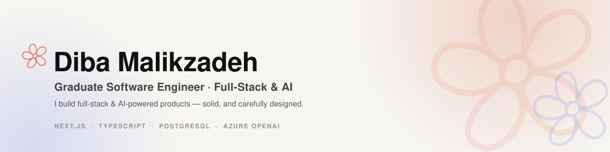
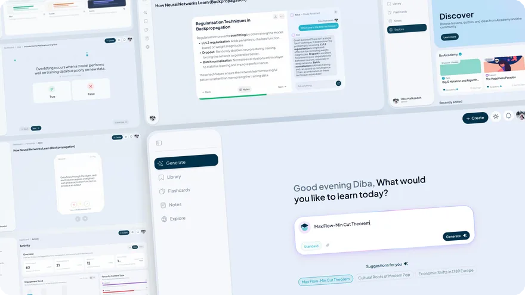
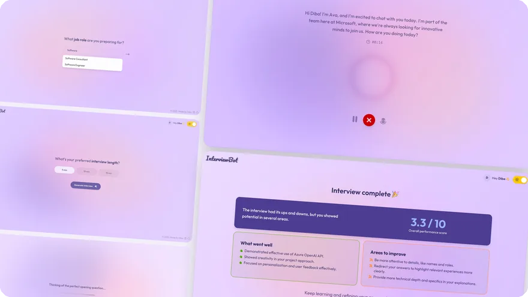
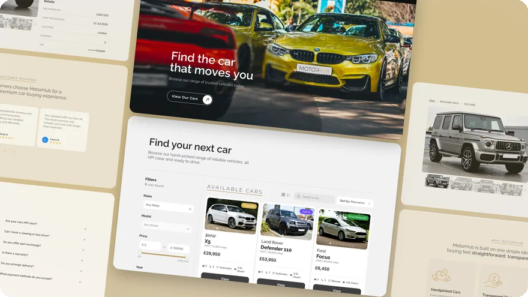
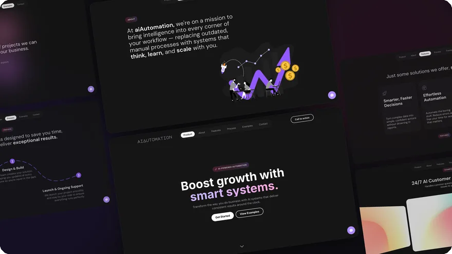
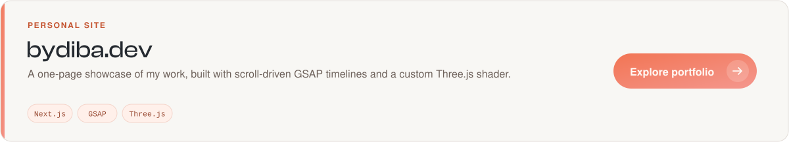
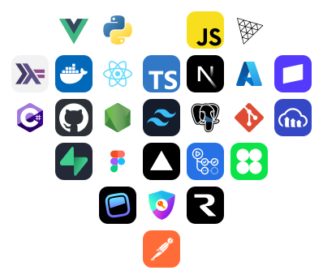
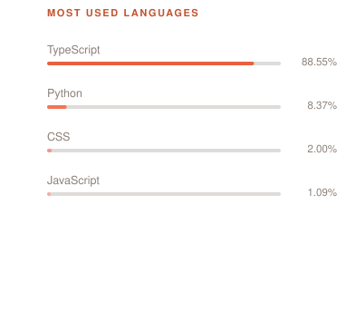

  

  &nbsp;&nbsp;&nbsp;&nbsp;

 

  <strong>First-Class Computer Science graduate from the University of Birmingham.</strong> 
  I build full-stack and AI-powered products that are both technically solid and carefully designed.

 

## ⭐️ Selected work

 

  
  
  

Aicademy turns a topic or uploaded document into a connected study system—structured learning paths, lessons, quizzes, spaced-repetition flashcards and notes, with a tutor grounded in the material.

I designed, built and shipped it solo as my final-year project (74%), tested it with 18 users, and have continued developing it into a live product.

 
 

  
  
  

A voice-based mock interview that adapts its questions to the role and company you choose. It can use a CV or job description as context, transcribes answers live and returns a score with strengths and practical feedback.

It was my first time working with AI and speech APIs, and I built and shipped the first version in roughly a week.

 
 

  
  

An end-to-end website for an independent UK car dealer. I created the brand, logo and visual direction, then built the public site around filterable stock, detailed vehicle pages and customer enquiries.

The private dashboard manages listings, images, customers and site content, and generates branded PDF invoices. Built for a real client and running in production.

 
 

  
  

A landing page concept I built to explore motion-heavy frontend work. It uses GSAP and Lenis for smooth scrolling, timed reveals and pinned transitions, alongside a custom WebGL fluid background.

 
 

 

<h2 align="center">🛠️ Toolkit</h2>

 

  

---

 

**Open to graduate/junior Software Engineer roles** — especially full-stack or AI product work.

📍 High Wycombe · London · Remote/hybrid (UK)

